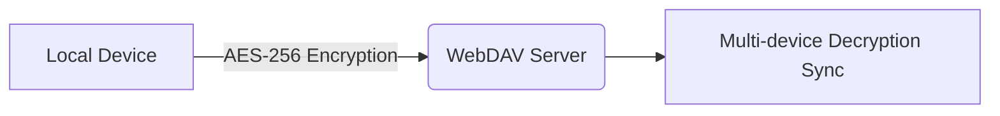

# Knot - Minimalist Cross-Scenario Recording Tool


## 🌟 Project Overview
**Knot** is an intelligent multi-scenario recording tool inspired by the minimalist concept of ancient "knot-tying" memorization. By integrating core modules such as todo lists, smart notes, and document reading with multi-platform client support, we create a full-scenario productivity toolchain.

*Etymology*: Just as ancient civilizations recorded important events with physical knots, we continue this simple yet efficient concept through digital "knots".

## 📱 Core Features

### Multi-modal Recording System
- **Smart Todo List**  
  Supports voice input (long-press add button), recurring reminders, and intelligent sorting
- **Markdown Notes**  
  Real-time preview + Syntax highlighting + Image/attachment embedding
- **Exercise Tracker**  
  Precision pedometer + GPS trajectory recording (cycling/running scenarios)
- **Data Dashboard**  
  Visualized statistics + Periodic report generation

### Multi-format Document Support
- E-book reader (EPUB/PDF/TXT)
- Document annotation system
- Cross-document content search

### Data Management System
- Local/cloud dual backup (WebDAV/OneDrive)
- Encrypted data synchronization (AES-256)
- Cross-platform data migration (Import/Export)

## 🖥️ Multi-Platform Support
| Platform    | Core Features                | Sync Solutions              |
|-------------|------------------------------|-----------------------------|
| Android     | Full feature experience      | Native cloud sync + Local backup |
| Windows     | Note/Todo editing            | Syncthing/WebDAV            |
| macOS       | Note/Todo editing            | Syncthing/WebDAV            |
| Linux       | Note/Todo editing            | Syncthing/WebDAV            |

## ⚙️ User Guide

### Cloud Sync Configuration
1. **WebDAV Sync**  
   `Main Menu > Cloud Sync` Configure server parameters and enable "Auto-Sync"
2. **Data Encryption**  
   `Settings > Preferences` Enable encryption for cloud data security

### Real-time Reminder Setup
1. Open Android System Settings
2. Navigate to "App Startup Management"
3. Allow Knot's background activities

### Permission Specifications
| Permission Type | Usage Scenario               | Configuration Path          |
|------------------|-------------------------------|-----------------------------|
| Storage          | Local data storage           | Auto-request on first launch|
| Microphone       | Voice memo functionality     | Long-press add button in Todo UI |
| Camera           | Note photography             | Attachment menu in note editor |
| GPS              | Exercise trajectory recording| Activated in fitness module |

## 📥 Download & Installation
**Latest Version Acquisition:**
- Scan QR code (Recommended for Android)  
    
- [GitHub Releases](https://github.com/ic005k/Knot/releases)
- [API](https://api.github.com/repos/ic005k/Knot/releases/latest)

## 🔒 Data Security Architecture


---

## 📜 Complete Open Source Acknowledgments
All dependencies are preserved in original format for maintenance and upgrades:

### Document Processing Components
| Project Name | Functionality | Repository Link |
|--------------|---------------|-----------------|
| **md4c** | Markdown parser | [mity/md4c](https://github.com/mity/md4c) |
| **cmark-gfm** | GitHub-flavored Markdown extension | [github/cmark-gfm](https://github.com/github/cmark-gfm) |

### Security & Utility Libraries
| Project Name | Functionality | Repository Link |
|--------------|---------------|-----------------|
| **Qt-AES** | Data encryption module | [bricke/Qt-AES](https://github.com/bricke/Qt-AES) |
| **quazip** | Compression/archive support | [stachenov/quazip](https://github.com/stachenov/quazip) |
| **ini4j** | Configuration file management | [ini4j](https://ini4j.sourceforge.net/) |
| **zlib** | Data compression algorithm | [zlib.net](https://zlib.net/) |

### UI & Auxiliary Tools
| Project Name | Functionality | Repository Link |
|--------------|---------------|-----------------|
| **QScintilla** | Desktop note editor | [QScintilla](https://riverbankcomputing.com/software/qscintilla/download) |

### Android-specific Components
| Project Name | Functionality | Repository Link |
|--------------|---------------|-----------------|
| **AndroidPdfViewerDemo** | Android PDF rendering | [qxcwanxss/AndroidPdfViewerDemo](https://github.com/qxcwanxss/AndroidPdfViewerDemo) |
| **Markwon** | Android Markdown rendering | [noties/Markwon](https://github.com/noties/Markwon) |
| **Prism4j** | Code highlighting support | [noties/Prism4j](https://github.com/noties/Prism4j) |

### Other Dependencies
| Project Name | Functionality | Repository Link |
|--------------|---------------|-----------------|
| **iconfinder** | Icon resources | [iconfinder](https://www.iconfinder.com/) |
| **cppjieba** | Chinese text segmentation | [yanyiwu/cppjieba](https://github.com/yanyiwu/cppjieba) |

---

## 🔗 Maintenance Reference
Recommended dependency update monitoring:
```bash
# Check repository status using GitHub CLI
gh repo view [REPO_NAME] --json name,url,updatedAt,pushedAt
```

All components follow their original open source licenses. Verify during upgrades:
1. License compatibility (GPL/LGPL/MIT)
2. API changelogs
3. Binary compatibility testing

---

> We welcome community contributions. Full technical documentation: [Technical Architecture](https://github.com/ic005k/Knot/wiki/Technical-Architecture)

> Complete dependency list: [build.gradle](https://github.com/ic005k/Knot/blob/main/android/build.gradle)

---

[](https://star-history.com/#ic005k/Knot&Date)
