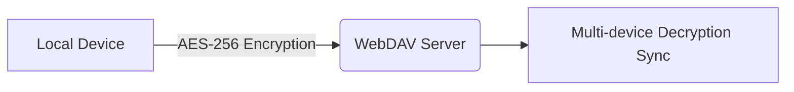

# Knot - Minimalist Cross-Scenario Recording Tool


## 🌟 Project Overview
**Knot** is an intelligent multi-scenario recording tool inspired by the minimalist concept of ancient "knot-tying" memorization. By integrating core modules such as todo lists, smart notes, document reading, and **local LLM-powered intelligence (via [llama.cpp](https://github.com/ggml-org/llama.cpp))**, we create a full-scenario productivity toolchain with multi-platform client support.

*Etymology*: Just as ancient civilizations recorded important events with physical knots, we continue this simple yet efficient concept through digital "knots".

<!-- 新增代码状态按钮 -->
[](https://github.com/ic005k/Knot/blob/stats/stats.txt)  
*Click to view code lines statistics (updated automatically)*

## 📱 Core Features

### Multi-modal Recording System
- **Smart Todo List**  
  Supports voice input (long-press add button), recurring reminders, and intelligent sorting
- **Markdown Notes**  
  Real-time preview + Syntax highlighting + Image/attachment embedding
- **Exercise Tracker**  
  Precision pedometer + GPS trajectory recording (cycling/running scenarios)
- **Data Dashboard**  
  Visualized statistics + Periodic report generation

### Multi-format Document Support
- E-book reader (EPUB/PDF/TXT)
- Document annotation system
- Cross-document content search

### Data Management System
- Local/cloud dual backup (WebDAV/OneDrive)
- Encrypted data synchronization (AES-256)
- Cross-platform data migration (Import/Export)

## 🖥️ Multi-Platform Support
| Platform    | Core Features                | Sync Solutions              |
|-------------|------------------------------|-----------------------------|
| Android     | Full feature experience      | Native cloud sync + Local backup |
| Windows     | Note/Todo editing            | Syncthing/WebDAV            |
| macOS       | Note/Todo editing            | Syncthing/WebDAV            |
| Linux       | Note/Todo editing            | Syncthing/WebDAV            |

## ⚙️ User Guide

### Cloud Sync Configuration
1. **WebDAV Sync**  
   `Main Menu > Cloud Sync` Configure server parameters and enable "Auto-Sync"
2. **Data Encryption**  
   `Settings > Preferences` Enable encryption for cloud data security

### Real-time Reminder Setup
1. Open Android System Settings
2. Navigate to "App Startup Management"
3. Allow Knot's background activities

### Permission Specifications
| Permission Type | Usage Scenario               | Configuration Path          |
|------------------|-------------------------------|-----------------------------|
| Storage          | Local data storage           | Auto-request on first launch|
| Microphone       | Voice memo functionality     | Long-press add button in Todo UI |
| Camera           | Note photography             | Attachment menu in note editor |
| GPS              | Exercise trajectory recording| Activated in location services module |
| Notification     | Todo reminder                | Auto-request on first launch |
| Step Counter     | Step counting                | Activated in fitness module |

---

# Background Permissions Setup Guide

## 1. Why Enable These Permissions?

Enabling the following permissions ensures core app functionality works properly:
- ​**Instant Task Reminders**: Prevents the system from closing the app during sleep mode to avoid missing critical alerts
- ​**Continuous Activity Tracking**: Allows GPS to record workout routes in the background (e.g., running, cycling)
- ​**Feature Integration**: Enables interaction with other apps/services (e.g., adding tasks from calendar)

> ⚠️ Potential issues if disabled:  
> • Delayed or missed reminders  
> • Interrupted workout tracking  
> • Some integration features unavailable

## 2. How to Configure? (Universal Steps)

Follow these steps (menu names may vary slightly across devices):
1. ​**Open System Settings**​  
   `Settings` → `Apps` / `Application Manager`

2. ​**Locate This App**​  
   Select the app from the list (use search bar if available)

3. ​**Enable Required Permissions**​  
   Activate these options as needed:  
   ✅ `Auto-start`  
   ✅ `Associated startup`  
   ✅ `Allow background activity`  
   ✅ Disable `Battery optimization`/`Power saving restrictions`

4. ​**Brand-Specific Settings Paths**​  
   | Brand       | Additional Configuration Path          |
   |-------------|-----------------------------------------|
   | Xiaomi      | Security Center → Permissions           |
   | Huawei      | Battery Optimization → All Apps List    |
   | OPPO        | Battery → High Power Consumption Protection |
   | vivo        | Background Power Management → Allow Background |
   | Samsung     | Settings → Battery → Background Usage Limits |
   | Google (Pixel) | Settings → Apps → [App Name] → Battery → Unrestricted |

---

## 📥 Download & Installation
**Latest Version Acquisition:**
- Scan QR code (Recommended for Android)  
    
- [GitHub Releases](https://github.com/ic005k/Knot/releases)
- [API](https://api.github.com/repos/ic005k/Knot/releases/latest)

## Download Statistics

| Platform   | Release File                      | Downloads                                                                 |
|------------|-----------------------------------|--------------------------------------------------------------------------|
| Android    | `android-build-release-signed.apk` |  |
| Linux      | `Knot-Linux-x86_64.AppImage`      |    |
| macOS      | `Knot-Mac.dmg`                    |                  |
| Windows    | `Knot-Win64.zip`                  |              |
| **Total**  | -                                 |            |

## 🔒 Data Security Architecture

```mermaid
graph LR
    A[Local Device] -->|AES-256 Encryption| B(WebDAV Server)
    B --> D[Multi-device Decryption Sync]
```

---

## 📜 Complete Open Source Acknowledgments
All dependencies are preserved in original format for maintenance and upgrades:

### Document Processing Components
| Project Name | Functionality | Repository Link |
|--------------|---------------|-----------------|
| **cmark-gfm** | GitHub-flavored Markdown extension | [github/cmark-gfm](https://github.com/github/cmark-gfm) |

### Security & Utility Libraries
| Project Name | Functionality | Repository Link |
|--------------|---------------|-----------------|
| **Qt-AES** | Data encryption module | [bricke/Qt-AES](https://github.com/bricke/Qt-AES) |
| **quazip** | Compression/archive support | [stachenov/quazip](https://github.com/stachenov/quazip) |
| **ini4j** | Configuration file management | [ini4j](https://ini4j.sourceforge.net/) |
| **zlib** | Data compression algorithm | [zlib.net](https://zlib.net/) |

### UI & Auxiliary Tools
| Project Name | Functionality | Repository Link |
|--------------|---------------|-----------------|
| **QScintilla** | Desktop note editor | [QScintilla](https://riverbankcomputing.com/software/qscintilla/download) |

### Android-specific Components
| Project Name | Functionality | Repository Link |
|--------------|---------------|-----------------|
| **AndroidPdfViewerDemo** | Android PDF rendering | [DImuthuUpe/AndroidPdfViewer](https://github.com/DImuthuUpe/AndroidPdfViewer) |
| **Markwon** | Android Markdown rendering | [noties/Markwon](https://github.com/noties/Markwon) |
| **Prism4j** | Code highlighting support | [noties/Prism4j](https://github.com/noties/Prism4j) |

### AI & Core Inference

| Project Name | Functionality | Repository Link |
|--------------|---------------|-----------------|
| **llama.cpp** | High-performance LLM inference engine | [ggml-org/llama.cpp](https://github.com/ggml-org/llama.cpp) |
| **sqlite-vec** | Read-write vector database | [asg017/sqlite-vec](https://github.com/asg017/sqlite-vec) |

### Other Dependencies
| Project Name | Functionality | Repository Link |
|--------------|---------------|-----------------|
| **iconfinder** | Icon resources | [iconfinder](https://www.iconfinder.com/) |

---

## 🔗 Maintenance Reference
Recommended dependency update monitoring:
```bash
# Check repository status using GitHub CLI
gh repo view [REPO_NAME] --json name,url,updatedAt,pushedAt
```

All components follow their original open source licenses. Verify during upgrades:
1. License compatibility (GPL/LGPL/MIT)
2. API changelogs
3. Binary compatibility testing

---

> We welcome community contributions. Full technical documentation: [Technical Architecture](https://github.com/ic005k/Knot/wiki/Technical-Architecture)

> Complete dependency list: [build.gradle](https://github.com/ic005k/Knot/blob/main/android/build.gradle)

---

[](https://star-history.com/#ic005k/Knot&Date)
